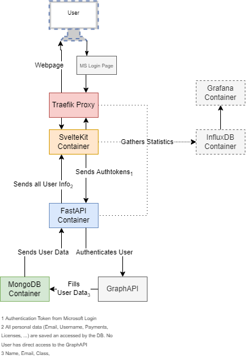

## Big Picture

### Containers

#### FastAPI

Contains the FastAPI application that serves as backend interface. It also automatically fetches required data from the Microsoft GraphAPI (not a container on its own) This container also contains various other, smaller functions, like datbase schemas, the database connection and email and pdf generation (Outsourced).

#### MongoDB

A MongoDB database that stores all presistent user data. 

#### SevelteKit

Contains the SvelteKit framework.

### Optional Containers

#### InfluxDB

The Influx database collects the data that is to be displayed in the Grafana dashboard.

#### Grafana

A Grafana dashboard that displays logging and health data collected from the FastAPI, MongoDB and Traefik Proxy.